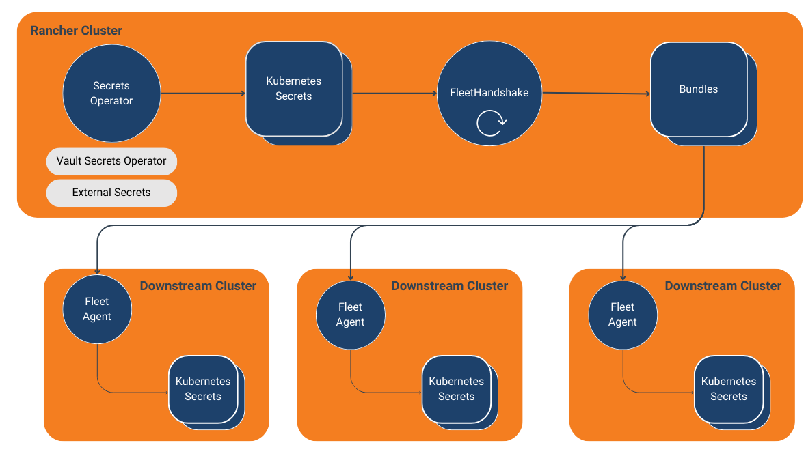

# Fleet Handshake


## Description

The Fleet Handshake Operator is a Kubernetes controller designed to leverage Fleet's bundle resource for syncing secrets across downstream clusters. It automates the distribution of Kubernetes secrets to multiple clusters using SUSE's Fleet.

Managing secrets across multiple clusters can be challenging, especially when aiming for a zero-trust setup. While it's possible to manually create secrets or set up individual sync processes for each cluster, Fleet Handshake offers a different solution. It uses the cluster that hosts the Fleet controller as the central source of truth for secrets, which Fleet agents then consume in downstream clusters.

This operator works with existing Kubernetes secrets, which may have been synchronized from external secret management systems like HashiCorp Vault using tools such as the External Secrets Operator or Vault Operator. The Fleet Handshake Operator then creates Fleet bundles to distribute these secrets to specified target clusters.


## Architecture



## Operator

The [Fleet Handshake Operator](./operator) is built around a custom resource definition (CRD) called `FleetHandshake`. This CRD defines which Kubernetes secrets should be synchronized and to which target clusters.

Key components of the operator include:

1. **FleetHandshakeReconciler**: The main controller that handles the reconciliation loop for `FleetHandshake` resources.

2. **Reconciliation Process**:
   - Fetches the `FleetHandshake` resource
   - Retrieves the target Kubernetes secret
   - Creates or updates a Fleet `Bundle` resource
   - Updates the status of the `FleetHandshake` resource

3. **Fleet Bundle Creation**: The operator creates Fleet `Bundle` resources that include the content of the Kubernetes secrets to be distributed.

4. **Error Handling and Status Updates**: Robust error handling is implemented throughout the reconciliation process, with status updates reflected in the `FleetHandshake` resource.

### Usage

1. Create a Kubernetes secret in your Rancher cluster that you want to distribute.

2. Create a `FleetHandshake` resource specifying the secret and target clusters. Samples can be found in the [operator examples](./operator/config/samples/).
   
3. Apply the `FleetHandshake` resource to your cluster.
```
kubectl apply -f fleethandshake.yaml
```

4. The operator will create the necessary Fleet bundles and bundle deployments to distribute the secret to the specified target clusters.


## Helm
To install the operator, and try it out, install via Helm into your rancher cluster.

```bash
helm repo add fleet-handshake https://rptcloud.github.com/fleet-handshake
helm install fleet-handshake fleet-handshake/fleet-handshake 
```
